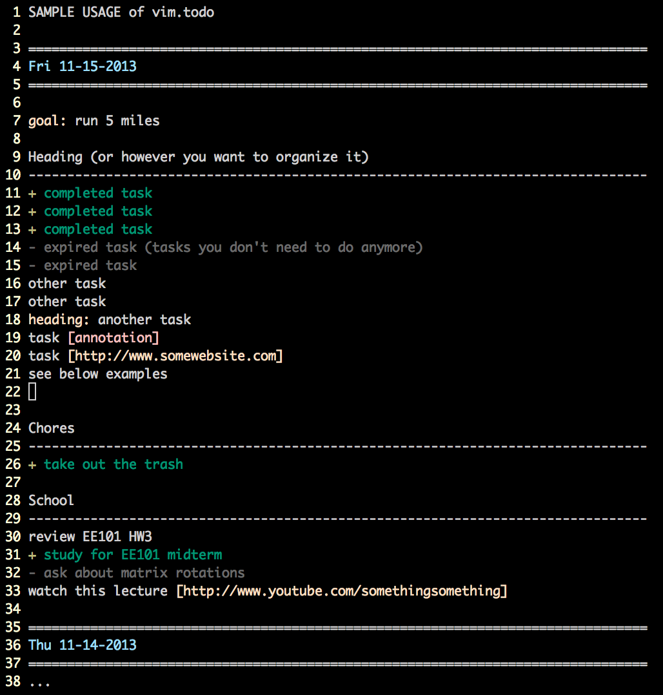

vim.todo
========
Simple vim syntax highlighting for todo lists

Setup
-----
    mv vim.todo ~/.vim/syntax/vim.todo

Optional setup for .vimrc
----------------------------
Add the following lines to your `~/.vimrc

    " Recommended color scheme
    set background=dark
    colorscheme desert256
    
    " Map function keys to print formatted new dates
    if has("unix")
        let s:uname = system("uname")
        if s:uname == "Darwin\n"
            " OSX has a dumb date utility, so use the Unix one
            " Setting the path in vim seems non-trivial, so directly call the
            " correct executable (vs. /bin/date)
            noremap <F2> o<ESC>80i=<ESC>:r !/opt/local/libexec/gnubin/date -d'0 day' '+\%a \%m-\%d-\%Y'<CR>o<ESC>80i=<ESC>o<ESC>
            noremap <F3> o<ESC>80i=<ESC>:r !/opt/local/libexec/gnubin/date -d'1 day' '+\%a \%m-\%d-\%Y'<CR>o<ESC>80i=<ESC>o<ESC>
            noremap <F4> o<ESC>80i=<ESC>:r !/opt/local/libexec/gnubin/date -d'2 day' '+\%a \%m-\%d-\%Y'<CR>o<ESC>80i=<ESC>o<ESC>
            noremap <F5> o<ESC>80i=<ESC>:r !/opt/local/libexec/gnubin/date -d'3 day' '+\%a \%m-\%d-\%Y'<CR>o<ESC>80i=<ESC>o<ESC>
            noremap <F6> o<ESC>80i=<ESC>:r !/opt/local/libexec/gnubin/date -d'4 day' '+\%a \%m-\%d-\%Y'<CR>o<ESC>80i=<ESC>o<ESC>
            noremap <F7> o<ESC>80i=<ESC>:r !/opt/local/libexec/gnubin/date -d'5 day' '+\%a \%m-\%d-\%Y'<CR>o<ESC>80i=<ESC>o<ESC>
            noremap <F8> o<ESC>80i=<ESC>:r !/opt/local/libexec/gnubin/date -d'6 day' '+\%a \%m-\%d-\%Y'<CR>o<ESC>80i=<ESC>o<ESC>
        else
            noremap <F2> o<ESC>80i=<ESC>:r !date -d'0 day' '+\%a \%m-\%d-\%Y'<CR>o<ESC>80i=<ESC>o<ESC>
            noremap <F3> o<ESC>80i=<ESC>:r !date -d'1 day' '+\%a \%m-\%d-\%Y'<CR>o<ESC>80i=<ESC>o<ESC>
            noremap <F4> o<ESC>80i=<ESC>:r !date -d'2 day' '+\%a \%m-\%d-\%Y'<CR>o<ESC>80i=<ESC>o<ESC>
            noremap <F5> o<ESC>80i=<ESC>:r !date -d'3 day' '+\%a \%m-\%d-\%Y'<CR>o<ESC>80i=<ESC>o<ESC>
            noremap <F6> o<ESC>80i=<ESC>:r !date -d'4 day' '+\%a \%m-\%d-\%Y'<CR>o<ESC>80i=<ESC>o<ESC>
            noremap <F7> o<ESC>80i=<ESC>:r !date -d'5 day' '+\%a \%m-\%d-\%Y'<CR>o<ESC>80i=<ESC>o<ESC>
            noremap <F8> o<ESC>80i=<ESC>:r !date -d'6 day' '+\%a \%m-\%d-\%Y'<CR>o<ESC>80i=<ESC>o<ESC>
        endif
    endif

Usage
-----
Create a file with a `.todo` extension.

